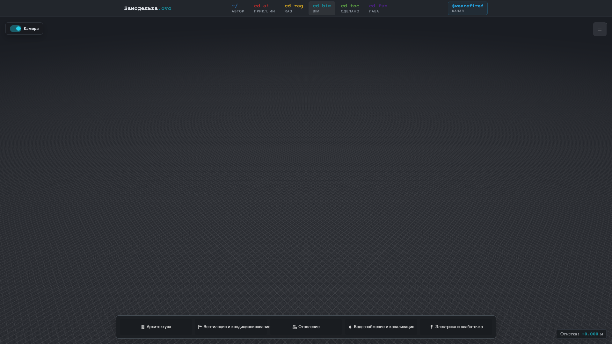
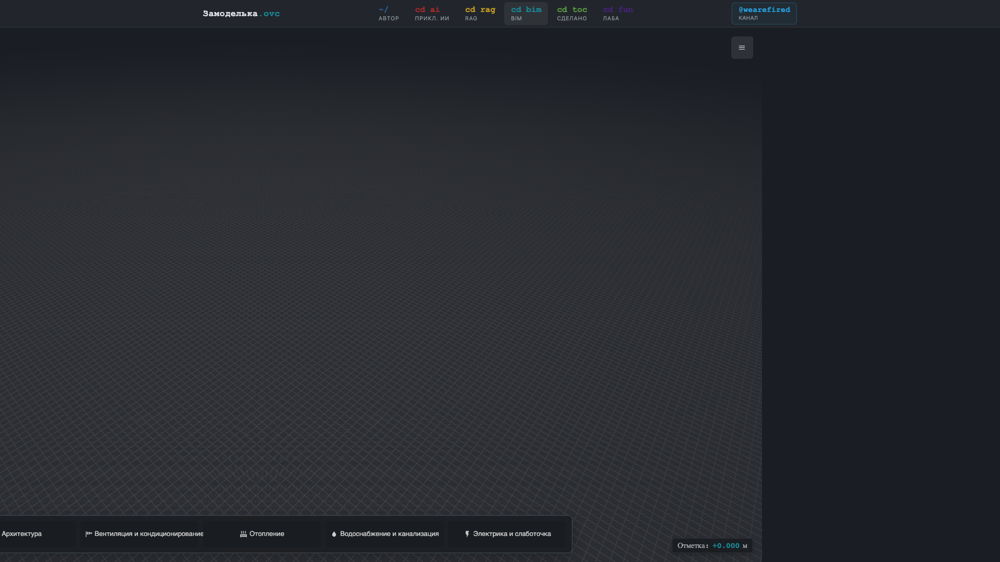

# Замоделька — flow-моделлер зданий

Версия: **0.0.1**

«Замоделька» (Zamodelka) — экспериментальный flow-моделлер для быстрой наброски здания и инженерных систем прямо в браузере. Идея проекта — не копировать тяжёлый BIM/CAD, а дать режим “как в игре”: чистый viewport, минимум постоянных панелей, контекстные действия, умные привязки, подсказки у курсора и автоматические узлы подключения.

Проект сделан на базе **That Open Engine**, Three.js, Vite и FastAPI.

---

## Скриншоты


*Чистый 3D viewport. Дисциплинарный dock снизу: Архитектура, Вентиляция, Отопление, ВиК, Электрика.*


*Активная дисциплина — инструменты воздуховодов, диффузоров, кондеев, VRV и подключений.*

---

## Flow Mode 0.0.1

Главный интерфейс теперь строится вокруг flow mode:

*   **Чистый экран моделирования:** viewport занимает почти всё окно, без постоянной Renga-like боковой панели.
*   **Нижний dock дисциплин:** `Архитектура`, `Вентиляция и кондиционирование`, `Отопление`, `Водоснабжение и канализация`, `Электрика и слаботочка`.
*   **Дисциплинарные режимы:** вход в дисциплину оставляет на экране только её действия и кнопку выхода. Пользователь выбирает не “панель инструментов”, а текущий строительный сценарий.
*   **Drawer в углу:** проектные панели, свойства, спецификация, системы и пометки доступны по кнопке меню и не мешают моделированию.
*   **Контекстные подсказки у курсора:** во время черчения показываются длина, отметка, активная привязка и горячие клавиши.
*   **Умные привязки:** трасса рядом со стеной предлагает параллельный ход и показывает wall-snap индикатор.
*   **Умная камера:** тумблер `Камера` в левом верхнем углу. По умолчанию камера сохраняет направление вида и вписывает текущий элемент целиком с запасом.
*   **Серийное подключение радиаторов:** в режиме `Подключить` сценарий идёт радиатор → двухтрубная магистраль → следующий радиатор.
*   **Схемы систем:** система открывается отдельным белым окном-листом A3 с аксонометрией отопления, рамкой и основной надписью в стиле СПДС/ЕСКД.

---

## Что умеет моделлер

### 1. Flow-интерфейс и drawer проекта
Постоянные инженерные панели убраны из первого плана. Нижний dock запускает дисциплины, а правый drawer хранит вкладки проекта:
*   **Параметры:** настройки текущего инструмента и уровней.
*   **Свойства:** данные выбранного элемента.
*   **Спецификация:** ведомость материалов и оборудования по текущей модели.
*   **Системы:** авто-сформированные системы, мини-ведомость и окно аксонометрической схемы.
*   **Модели:** IFC/Fragment-подложки, видимость и ghost-режим.
*   **Пометки:** 3D-пины комментариев на элементах.

### 2. Умные привязки (SmartSnap)
При рисовании стен, трасс или расстановке оборудования строит линии выравнивания по осям X/Z относительно других элементов. Для двухтрубки отопления рядом со стеной включается wall-snap: подсвечивается грань стены и показывается preview трассы, которая ляжет параллельно стене без ручного переключателя `По стене / Свободно`.

### 3. Автоматическая вертикальная трассировка стояков
При прорисовке воздуховодов, труб или кабельных лотков:
*   Ввод чисел на клавиатуре задает точную длину прямого участка в мм.
*   Нажатие **`Tab`** переключает на ввод высоты отметки.
*   **Умный CAD-переход:** Если проектировщик активно ведет трассу и меняет отметку высоты (горячими клавишами, на тулбаре или в боковом меню), инструмент **автоматически вычерчивает вертикальный сегмент** от текущей точки до новой высоты по тем же X/Z координатам с авто-генерацией фитингов переходов. После этого горизонтальное черчение бесшовно продолжается на новой высоте.

### 4. Контекстные параметры сечений
Параметры текущего инструмента появляются только в активном сценарии дисциплины:
*   **Воздуховод (Duct):** Выбор вентиляционной системы, формы сечения (Круглый/Прямоугольный) и выпадающий список типоразмеров (сечений).
*   **Кабельный лоток (Tray):** Выбор размеров лотка (ширина х высота).
*   **Трубопровод (Pipe):** Выбор сантехнической системы (ХВС/ГВС/Канализация), материала (Сталь/ППR) и диаметра.
*   **Стена (Wall):** Ввод высоты стены, выбор толщины и материала.
Параметры синхронизированы с drawer-вкладкой проекта.

### 5. Умное нижнее подключение радиаторов
В дисциплине `Отопление` есть режим **Подключить**. Он работает серийно: пользователь кликает радиатор, затем одну трубу двухтрубной магистрали, а система сама:
*   находит вторую трубу пары по `pairId`;
*   режет подачу и обратку в точках подключения;
*   строит две подводки нижнего узла;
*   наследует диаметр, материал, сортамент и систему от магистрали;
*   пересобирает фитинги и инженерную систему.

### 6. Умная камера и cursor UX
Камера может автоматически вписывать текущий элемент с запасом, не меняя направление взгляда. В левом верхнем углу есть тумблер `Камера`, потому что такая помощь должна быть управляемой. В активных режимах курсор и подсказка у курсора меняются по контексту: можно выбрать радиатор, можно подключиться к магистрали, можно поставить точку трассы.

### 7. Исправленные инструменты измерений (Линейка, Площадь) и Сечения
*   **Линейка (Length):** Работает на одиночные клики — первый клик ставит начало, второй клик фиксирует конец измерения.
*   **Площадь (Area):** Одиночные клики последовательно добавляют вершины, а двойной клик (или клавиша Enter) завершает построение и закрашивает полигон.
*   **Сечение (Clipper):** Одиночный клик по любой части модели мгновенно создает секущую плоскость в месте курсора.
*   **Работают и при загруженном IFC.** Измерения и сечение строятся по собственным элементам (воздуховоды/стены/лотки/трубы) и рабочей плоскости. Ранее при загрузке IFC они молча отказывали — из-за того, что GPU-геометрия фрагментов роняла рейкастер; теперь такие меши исключены из набора для рейкаста. По поверхности самого IFC измерения не привязываются (фрагменты не берутся стандартным raycast).

### 8. Подключение диффузоров и решеток
Диффузоры и решетки можно расставлять свободно на сцене. При выделении прибора в правой панели свойств кнопка **«Подключить к воздуховоду»** активирует режим выбора воздуховода: клик по нужному коробу автоматически строит к нему ответвление через `FittingGenerator`.

### 8.1 Пометки (аннотации)
Кнопка **«Пометка»** в секции тулбара **«Аннотации»** включает режим расстановки: клик в любой точке сцены → прямо там появляется поле ввода текста (**Enter** — сохранить, **Esc** — отмена). Пометка показывается пином в 3D и сохраняется вместе с проектом. (Без браузерного `prompt`.)

Список всех пометок — во вкладке **«Пометки»** нижне-левого блока (рядом со «Спецификацией»): клик по пометке перелетает камерой к ней, есть удаление. *(Здесь же позже появятся «Видовые точки» — это тот же механизм: сохранённая 3D-точка + положение камеры.)*

### 9. Управление клавиатурой и привязки
*   **Удаление:** Клавиши **`Delete`** / **`Backspace`** удаляют выбранный элемент с автоматическим перестроением фитингов.
*   **Перемещение стрелками:** Стрелки сдвигают выделенный объект на 100 мм по осям X/Z. Зажатый **`Shift`** уменьшает шаг сдвига до 10 мм.
*   **Привязка окон/дверей к стенам:** Двери, окна и настенное оборудование привязываются к стенам в радиусе 400 мм и перемещаются вслед за изменением траектории стены.
*   **Смена отметок по этажам:** Горячие клавиши **`[`** / **`]`** и **`Q`** / **`E`** переключают чертежную отметку на предыдущий/следующий уровень этажа.
*   **Привязка к IFC:** Осуществляется строго с зажатой клавишей **`Alt`**, защищая обычное плоское черчение от застреваний курсора на сложных гранях подложки.

---

## Технологический стек

### Фронтенд
*   **Core 3D САПР:** `@thatopen/components` (`~3.2.0`), `@thatopen/fragments`, `@thatopen/ui`
*   **Рендерер:** `three` (`0.175.0`)
*   **Сборка:** `vite` (`^7.1.5`), TypeScript
*   **Веб-интерфейс:** `@thatopen/ui` на базе Lit-представлений с адаптивной сеткой CAD.

### Бэкенд
*   **Фреймворк:** FastAPI (Python 3.10+)
*   **База данных:** SQLite (`vent_mvp.db` в корне проекта)
*   **Экспорт спецификаций:** Автоматическая генерация красивых спецификаций материалов и оборудования по ГОСТ в Excel (`xlsx`).
*   **Экспорт моделей:** Полный экспорт всей нарисованной сцены в трехмерный физический формат `IFC2x3`.
*   **Экспорт в Revit:** Выгрузка всей трассы с привязкой по системам и уровням в BIM JSON-контракт для скриптов pyRevit / Revit API аддонов.

---

## Быстрый запуск

### 1. Локальная разработка

#### Запуск бэкенд-сервера:
```bash
# Перейдите в папку проекта
cd vent_mvp
# Активируйте виртуальное окружение Python
source server/.venv/bin/activate
# Запустите сервер FastAPI
python3 -m server.main
```
Сервер запустится по адресу: `http://127.0.0.1:8000`.

#### Запуск клиентской части:
```bash
# Установите зависимости (если требуется)
npm install
# Запустите Vite dev-сервер
npm run dev
```
Интерфейс САПР откроется по адресу: `http://localhost:5173/`.

### 2. Сборка и деплой на Production (VPS)
Статические файлы фронтенда собираются через Vite и раздаются веб-сервером Caddy:
```bash
# Сборка production билда
npm run build
# Синхронизация файлов на продакшн-сервер
rsync -avz --delete dist/ root@VPS_HOST:/var/www/zamodelka/
```
FastAPI сервер проксируется Caddy на удаленном VPS.
